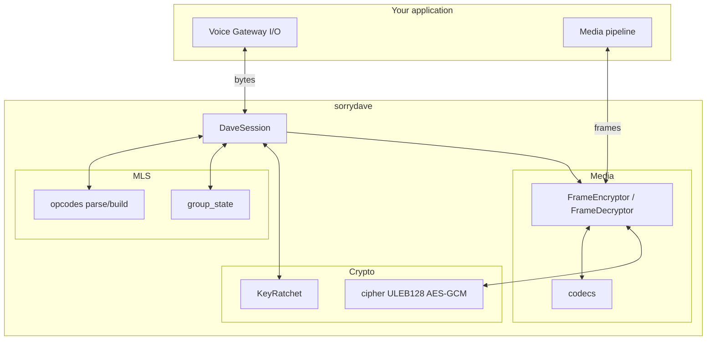

# Architecture

This page describes where sorrydave sits in the stack, how data flows through it, and how the documentation maps to the source code.

---

## Purpose

sorrydave is a **pure data-transformation and state-management layer**. It does **not** perform I/O or networking. Your application:

- Receives opcode payloads and media frames from the Voice Gateway (e.g. WebSocket).
- Passes those bytes into sorrydave (session methods, opcode parsers, encryptor/decryptor).
- Sends the bytes that sorrydave returns (opcode 26/28/31 payloads, encrypted frames) back over the gateway or media channel.

---

## Component diagram

- **DaveSession**: Single facade. Handles "prepare epoch", "handle opcode 25/27/29/30", "execute transition", and provides encryptor/decryptor.
- **MLS (opcodes, group_state)**: Voice Gateway opcode parsing and building; MLS group creation, key package, commit, welcome, proposals; rfc9420 integration.
- **Crypto (ratchet, cipher)**: Per-sender key ratchet (HKDF, cache); ULEB128 and truncated AES128-GCM for frame encryption.
- **Media (codecs, transform)**: Codec-specific unencrypted ranges; frame encrypt/decrypt with DAVE supplemental footer.

---

## Data flow

| Input | Flow | Output |
|-------|------|--------|
| Opcode 25 payload (bytes) | `handle_external_sender_package` → opcodes parse → group_state (create group) | — |
| Epoch 1 signal | `prepare_epoch(1)` → group_state (key package) → opcodes build | Opcode 26 payload (bytes) |
| Opcode 27 payload | `handle_proposals` → opcodes parse → group_state (process, commit/welcome) → opcodes build | Opcode 28 payload or None |
| Opcode 29 payload | Parse → `handle_commit` → group_state (apply_commit) → refresh ratchets | — |
| Opcode 30 payload | Parse → `handle_welcome` → group_state (join_from_welcome) → refresh ratchets | — |
| Opcode 22 payload | Parse → `execute_transition` | — (ratchets refreshed) |
| Encoded frame + codec | `get_encryptor().encrypt(frame, codec)` → codecs (ranges) → cipher → transform | Protocol frame (bytes) |
| Protocol frame | `get_decryptor(sender_id).decrypt(frame)` → transform → cipher → codecs | Decrypted frame (bytes) |

All inputs and outputs are **bytes**; no sockets or file I/O inside sorrydave.

---

## File map

| Documentation / API topic | Source |
|---------------------------|--------|
| DaveSession, session lifecycle | `sorrydave/session.py` |
| Types (UnencryptedRange, ProtocolSupplementalData, DaveConfiguration, IdentityConfig) | `sorrydave/types.py` |
| Exceptions (DaveProtocolError, DecryptionError, InvalidCommitError) | `sorrydave/exceptions.py` |
| Identity (fingerprint, displayable_code, epoch_authenticator_display) | `sorrydave/identity.py` |
| Opcodes 22, 25–31 and other Voice Gateway parse/build | `sorrydave/mls/opcodes.py` |
| Group creation, key package, commit, welcome, apply_commit, process_proposal, etc. | `sorrydave/mls/group_state.py` |
| FrameEncryptor, FrameDecryptor, protocol_frame_check | `sorrydave/media/transform.py` |
| get_unencrypted_ranges, codec-specific ranges | `sorrydave/media/codecs.py` |
| KeyRatchet, sender_base_secret_from_exporter | `sorrydave/crypto/ratchet.py` |
| ULEB128, expand_nonce_96, encrypt_interleaved, decrypt_interleaved | `sorrydave/crypto/cipher.py` |

Package entry point and re-exports: `sorrydave/__init__.py`, `sorrydave/mls/__init__.py`, `sorrydave/media/__init__.py`, `sorrydave/crypto/__init__.py`.
